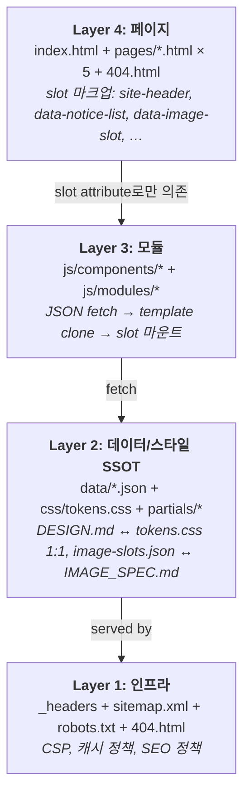
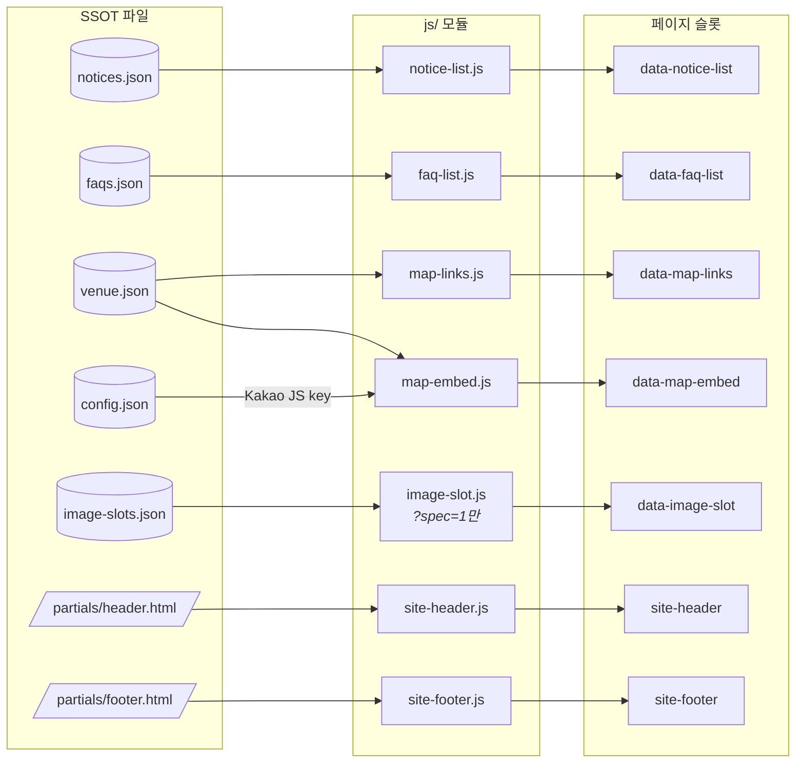
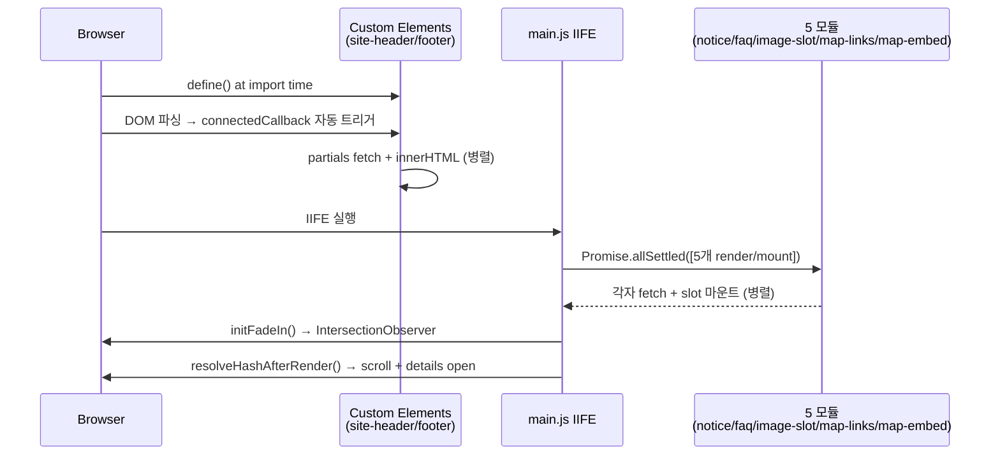
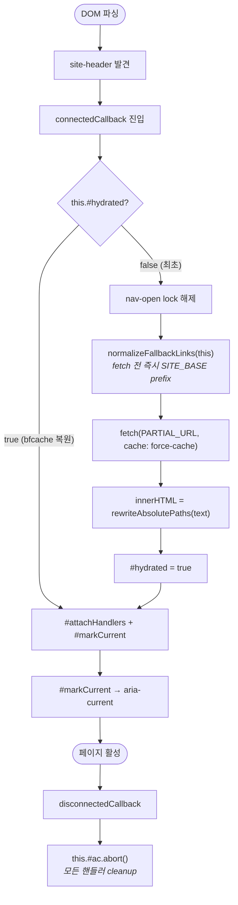

# Architecture

> [!NOTE]
> **Diátaxis: Explanation.** "왜 이렇게 설계됐는가"와 "각 부분이 어떻게 맞물려 있는가"를 다룹니다.
> 작업 절차(How-to)는 [README][rm]과 [ONBOARDING][ob], 데이터 스펙(Reference)은 [SCHEMAS][sc]와 [DESIGN][ds]을 참조하세요.

[rm]: ./README.md
[ob]: ./ONBOARDING.md
[sc]: ./docs/SCHEMAS.md
[ds]: ./DESIGN.md
[infra]: ./docs/INFRA.md
[changelog]: ./CHANGELOG.md
[image]: ./docs/IMAGE_SPEC.md
[claude]: ./CLAUDE.md

---

## 1. 시스템 개요

### 1-1. 결정: MPA + No-build + Vanilla JS

본 사이트는 단일 주말 페스티벌(2026-06-27, 1일) 행사 페이지이므로 다음 제약을 우선시했다:

| 제약 | 결정 |
|---|---|
| 운영 기간 < 6개월, 콘텐츠 변경 빈도 낮음 | 빌드 파이프라인 도입 비용이 운영 이득을 초과 → **No-build** |
| 페이지 5~6개, 인터랙션 단순 | SPA 라우터 불필요 → **MPA** |
| 도메인 모델 거의 없음 (정적 콘텐츠 + JSON 게시판) | 프레임워크 학습/배포 오버헤드 회피 → **Vanilla ES Module** |
| 디자이너 핸드오프 + 데이터 분리 필수 | 정적이지만 **데이터-마크업 분리** 유지 (`<template>` + JSON SSOT) |

이 결정의 트레이드오프:
- **얻은 것**: 의존성 0, 빌드 시간 0, 호스팅 비용 0 (GitHub Pages / Cloudflare Pages 무료 티어), 디버깅 표면 작음
- **포기한 것**: TypeScript 정적 타입 보호, 컴포넌트 hot-reload, SEO 최적 (게시판 상세 URL 단일화)
- **언제 재검토** — README §13 마이그레이션 우선순위 #6: 게시판 SEO/SNS 공유 트래픽이 중요해질 때 Eleventy SSG로 전환 가능 (Vanilla 모듈은 그대로 호환).

### 1-2. 4계층 멘탈 모델



> [!TIP]
> 각 레이어는 **상위 레이어가 하위 레이어를 모르도록** 설계됐다. 페이지는 모듈을 모르고(슬롯 attribute만 안다), 모듈은 페이지를 모르고(슬롯 querySelectorAll만 한다), 데이터는 양쪽 모두를 모른다.

---

## 2. SSOT 계층도

본 프로젝트는 **5개의 진실원(Single Source of Truth)**이 책임을 분담한다. 같은 정보를 두 곳에서 관리하지 않는 것이 모든 룰의 출발점.

| SSOT | 책임 | 동기화 대상 | 검증 |
|---|---|---|---|
| [`DESIGN.md`](./DESIGN.md) | 디자인 시스템 (colors / typography / spacing / rounded / sizes / components) | `css/tokens.css` (이름·값 1:1 매핑) | `npx @google/design.md lint DESIGN.md` |
| [`docs/IMAGE_SPEC.md`](./docs/IMAGE_SPEC.md) | 이미지 슬롯 인벤토리 + 디자이너 핸드오프 | `data/image-slots.json` (사본 관계, JSON이 먼저) | `?spec=1` 모드 시각 확인 |
| `partials/header.html`, `partials/footer.html` | 헤더/푸터 마크업 | 6개 페이지 + 404.html의 `<site-header>` fallback content | grep으로 7곳 동시 갱신 확인 |
| `data/*.json` | 게시판 콘텐츠 + 장소 + 설정 | 모듈이 fetch만 함 (편집은 JSON에서) | 스키마는 [`docs/SCHEMAS.md`](./docs/SCHEMAS.md) |
| `_headers` | CSP + 캐시 정책 | 외부 도메인 추가 시 동기 갱신 | [`docs/INFRA.md`](./docs/INFRA.md) 절차 |

**Anti-pattern (모든 SSOT 위반)**:
- 색상 hex를 컴포넌트 CSS에 직접 작성 (DESIGN.md → tokens.css 거치지 않음)
- 공지 항목을 HTML에 직접 작성 (data/notices.json 미사용)
- 외부 CDN 추가하면서 `_headers` CSP 갱신 누락
- 헤더 메뉴를 `partials/header.html`만 고치고 fallback 7곳 안 고침

---

## 3. 데이터 흐름

### 3-1. SSOT → 모듈 → 페이지 슬롯 매핑



### 3-2. 마운트 순서 (`js/main.js`)



> [!IMPORTANT]
> `allSettled`를 쓰는 이유: 한 모듈의 JSON fetch 실패가 다른 모듈을 차단하면 안 됨. 각 모듈은 자체 `try/catch`로 `role="alert"` fallback 에러 메시지를 노출한다(`renderFallbackError` 헬퍼).

---

## 4. Custom Element 패턴

### 4-1. 왜 `<site-header>` Web Component인가

이전 안: `<div data-include="/partials/header.html"></div>` + `mountIncludes()` 함수. 이걸 버린 이유:
- `div` slot은 JS 없는 환경에서 **완전히 비어있음** (SEO/a11y 손실)
- 마운트 타이밍이 main.js의 책임 → 순서 의존성 증가
- subpath 환경에서 `/partials/`가 깨짐 → root-absolute 경로 처리 추가 필요

현재 안: `<site-header>` custom element + fallback content. 이게 해결하는 것:

| 문제 | Web Components 해법 |
|---|---|
| JS 없는 환경에서 헤더 사라짐 | fallback `<header>`가 그대로 렌더 — partial fetch 실패해도 메뉴 보임 |
| partial fetch 전 short window의 빈 헤더 | fallback이 그 시간 동안 표시 → CLS 0 |
| main.js의 마운트 책임 비대화 | 엘리먼트가 `connectedCallback`에서 셀프 하이드레이트 — main.js는 import만 |
| subpath 환경의 `/pages/...` 경로 깨짐 | `rewriteAbsolutePaths` + `normalizeFallbackLinks`로 fetch 결과/fallback 둘 다 SITE_BASE prefix |

### 4-2. 라이프사이클



### 4-3. AbortController로 핸들러 cleanup

`#attachHandlers`는 `AbortController` 하나 생성 후 모든 `addEventListener`에 `{ signal }` 전달. `disconnectedCallback`에서 `abort()` 1회로 전체 리스너 해제. 메모리 누수 0.

예외: Safari < 14는 `MediaQueryList.addEventListener`를 지원하지 않으므로 `addListener` 사용 + `signal.addEventListener('abort', ...)` 수동 해제로 동등 효과.

### 4-4. bfcache 복원 처리

`pageshow` 이벤트의 `e.persisted === true`면 bfcache 복원. 이 경우 nav-open 상태가 모바일 메뉴 열린 채로 복원될 수 있어 명시적으로 reset:

```js
window.addEventListener('pageshow', (e) => {
  if (!e.persisted) return;
  document.documentElement.classList.remove('nav-open');
  // nav.dataset.open = 'false', toggle aria-expanded = 'false' ...
});
```

---

## 5. Subpath 호환 메커니즘

### 5-1. 두 배포 환경

| 환경 | URL | SITE_BASE |
|---|---|---|
| GitHub Pages (테스트) | `https://mayday-partners.github.io/namsan-green-summer/` | `/namsan-green-summer/` |
| Cloudflare Pages (프로덕션) | `https://namsangreensummer.com/` | `/` |

**동일 코드 + 동일 git 브랜치로 두 환경 모두 동작**해야 한다. 환경별 빌드 분기 없음.

### 5-2. `import.meta.url`이 핵심

`new URL('../../data/notices.json', import.meta.url)`은 모듈이 어떤 base에서 import됐든 자동으로 절대 URL로 resolve한다. 즉:
- GH Pages: `https://mayday-partners.github.io/namsan-green-summer/data/notices.json`
- Cloudflare: `https://namsangreensummer.com/data/notices.json`

`'/data/notices.json'` 같은 문자열 literal은 절대 쓰지 않는다(GH Pages에서 깨짐).

### 5-3. SITE_BASE 자동 감지

`site-header.js` / `site-footer.js`에서:
```js
const SITE_BASE = new URL('../../', import.meta.url).pathname;
// GH Pages → '/namsan-green-summer/'
// Cloudflare → '/'
```

이 값을 두 곳에서 사용:

**a) `rewriteAbsolutePaths(html)`** — partial fetch 결과 처리
```js
function rewriteAbsolutePaths(html) {
  if (SITE_BASE === '/') return html;   // Cloudflare는 no-op
  return html.replace(/((?:href|src)\s*=\s*["'])\/(?!\/)/g, `$1${SITE_BASE}`);
}
```
정규식 해설: `href="/...` 또는 `src="/...`에서 시작 슬래시 직후에 슬래시가 없는 경우(즉 protocol-relative `//cdn.example.com`이 아닌 경우)만 prefix 적용.

**b) `normalizeFallbackLinks(root)`** — fallback content 처리
```js
function normalizeFallbackLinks(root) {
  if (SITE_BASE === '/') return;
  root.querySelectorAll('a[href^="/"]').forEach(a => {
    const href = a.getAttribute('href');
    if (href && !href.startsWith('//')) {
      a.setAttribute('href', SITE_BASE + href.slice(1));
    }
  });
}
```
`connectedCallback` 진입 즉시 호출 — fetch 결과를 기다리지 않고 fallback 링크를 먼저 정규화. 결과: subpath 환경에서 fetch 완료 전에 fallback이 보여도 링크가 깨지지 않음.

### 5-4. 코드 작성 규약 (subpath 환경 호환을 깨지 않으려면)

| ✗ 금지 | ✓ 권장 |
|---|---|
| HTML에 `<a href="/pages/event.html">` | `<a href="pages/event.html">` (페이지-상대) |
| JS에 `fetch('/data/notices.json')` | `fetch(new URL('../../data/notices.json', import.meta.url))` |
| HTML에 `<link rel="stylesheet" href="/css/main.css">` | `<link rel="stylesheet" href="css/main.css">` (index) / `"../css/main.css"` (pages) |
| partial 내부 `/pages/...` | `/pages/...` 그대로 OK (custom element가 `rewriteAbsolutePaths`로 자동 처리) |

---

## 6. Hybrid 다크 컨테이너 패턴

### 6-1. 디자인 의도

전체 페이지 베이스는 **라이트 paper(`#F4F8EE`)** — 편집 잡지 느낌. 그런데 페스티벌의 정체성에는 네온 + 야간 무드도 필수. 이 둘을 한 페이지에 공존시키는 패턴이 "Hybrid 다크 컨테이너":

> [!TIP]
> 페이지는 라이트, **일부 섹션만 다크 surface로 띄워서** 그 안에서만 neon-on-dark 대비를 유지.

### 6-2. 현재 4가지 구현 (의도는 같으나 코드는 별개)

| 구현 | 위치 | 패턴 |
|---|---|---|
| `.hero` (홈) | `css/home.css` | `position: relative` + `.hero__bg::after` linear-gradient 오버레이로 자체 dark scrim. 페이지 하단으로 neutral fade-out |
| `.preview` (홈) | `css/home.css` | 풀-블리드 background-image + `.preview__overlay--ltr` / `--rtl` directional gradient로 텍스트 영역만 dark |
| `.program-card` (홈) | `css/home.css` | `background: var(--color-dark-surface)` 카드. 페이지 배경(라이트) 위에 다크 카드 띄움. 3종 program color로 border |
| `.dark-section` | `css/components/dark-section.css` | 재사용 가능한 다크 컨테이너 컴포넌트. 현재 **HTML에서 미사용** (§7-2 참조) |

### 6-3. 왜 4개를 통합하지 않았나

- `.hero`/`.preview`는 페이지별 background-image와 강하게 결합된 풀-블리드 섹션. 일반화하면 props가 폭증.
- `.program-card`는 카드 grid 레이아웃의 일부. 외부 modifier로 분리하면 카드 시스템이 복잡해짐.
- `.dark-section`은 **장래의 Summer Night 전용 feature section**을 위해 미리 정의된 일반 컨테이너 — 도입 시점 미정.

각 구현은 의도(dark-on-light 무드)를 공유하지만 책임(섹션 전용 / 카드 / 일반 컨테이너)이 달라 강제 통합이 오히려 손해. 단, 새 다크 섹션이 필요하면 먼저 `.dark-section` 컴포넌트 사용을 검토.

---

## 7. 진행 중 / 미활성 인프라

본 프로젝트에는 "정의됐으나 아직 활성화되지 않은" 자산이 있다. 정리(삭제) 작업 시 반드시 도입 의도를 확인.

| 자산 | 상태 | 확인 위치 |
|---|---|---|
| `css/components/dark-section.css` + DESIGN.md "Dark section" prose | 정의 완료, HTML 6페이지 사용처 0 | `grep -r "dark-section" pages/ index.html 404.html` |
| `--size-tap-target: 44px` (WCAG 2.2 SC 2.5.8) | tokens.css 정의, 컴포넌트 미참조 | DESIGN.md prose에 "reserved" 명시 |
| `forms.example.com` (외부 폼 시스템 placeholder) | `_headers`의 `form-action` CSP에 등록, 6페이지 CTA href에 사용 | 실 폼 시스템 도입 시 일괄 교체 + CSP 갱신 |
| `docs/superpowers/plans/*.md` (i18n 등 11개) | git untracked (CLAUDE.md 룰), 로컬 작업 산출물 | 진행 중 계획이면 별도 인터뷰로 파악 |
| README §13 마이그레이션 우선순위 #6 (SSG) | 미진행, 콘텐츠 규모에 따라 결정 | `data/notices.json` 항목 수가 30+ 되면 재검토 |

이 항목들의 변경 이력은 [`CHANGELOG.md`](./CHANGELOG.md)와 git log에서 추적 가능.

---

## 관련 문서

| 문서 | 모드 | 다루는 것 |
|---|---|---|
| [README][rm] | Tutorial + How-to + Reference | 빠른 시작, 디렉토리, 작업 절차 |
| [ONBOARDING][ob] | Tutorial | 처음 30분 가이드 |
| [DESIGN][ds] | Reference + Explanation | 디자인 시스템 SSOT |
| [SCHEMAS][sc] | Reference | `data/*.json` 스키마 |
| [INFRA][infra] | Reference + How-to | CSP, 캐시, 외부 도메인 |
| [IMAGE_SPEC][image] | How-to + Reference | 디자이너 핸드오프 |
| [CLAUDE][claude] | Reference | AI 에이전트 룰 |
| [CHANGELOG][changelog] | Reference | 변경 이력 |
